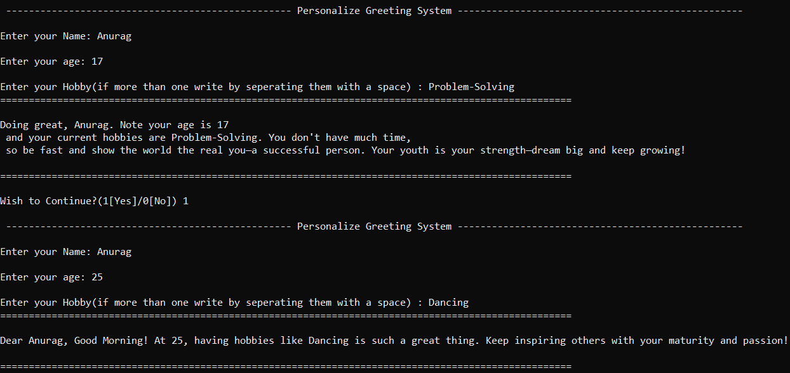

# 🚀 Project 01 – Personalized Greeting System


---

## 🌟 Why This Project Stands Out

- **Interactive & Personalized:** Delivers motivational greetings tailored to user input (name, age, hobbies).
- **Robust Input Validation:** Handles edge cases and errors gracefully for a seamless user experience.
- **Randomized & Dynamic:** Uses Python’s `random` module for varied, engaging output.
- **Clean UI:** Terminal output is formatted for clarity and professionalism.
- **Extensible Design:** Modular code structure ready for future enhancements (GUI, multi-language, persistent storage).

---

## 🧑‍💻 Skills Demonstrated

- Advanced Python (functions, error handling, input validation)
- User-centric design & UX
- Modular, maintainable code
- CLI application development
- Open-source best practices

---

## 📸 Demo


---

## 🛠️ Features

- **Interactive Prompts:** Name, age, hobbies (supports multiple hobbies).
- **Input Validation:** Age must be between 5 and 100; friendly error messages.
- **Randomized Greetings:** Age-appropriate, motivational messages.
- **Formatted Output:** Clear separators and line breaks for readability.
- **Easy to Extend:** Add new greetings, languages, or a GUI with minimal changes.

---

## 🚀 Quick Start

1. **Clone the repository:**
   ```bash
   git clone https://github.com/anurag-ds/learning-python-2025.git
   ```
2. **Navigate to the project directory:**
   ```bash
   cd learning-python-2025/project01_greeting
   ```
3. **Run the script:**
   ```bash
   python greeting.py
   ```
4. **Follow the prompts:**  
   Enter your name, age, and hobbies.  
   Receive a personalized greeting in the terminal.

---

## 🏗️ Project Structure

```
project01_greeting/
│
├── greeting.py      # Main application script
├── README.md        # Project documentation
└── images/
    └── output.gif   # Demo GIF
```

---

## 💡 Future Enhancements

- GUI interface (Tkinter/PyQt)
- Save greetings to a file
- Multi-language support
- Enhanced input validation

---

## 👤 Author

**Anurag Gupta**  
📧 [askquestiontoanurag@gmail.com](mailto:askquestiontoanurag@gmail.com)  
🌐 [GitHub Profile](https://github.com/anurag-ds)

---

## 📄 License

This project is licensed under the MIT License. See the LICENSE file for details.

---

> **Ready to make your team more awesome? Let’s connect!**