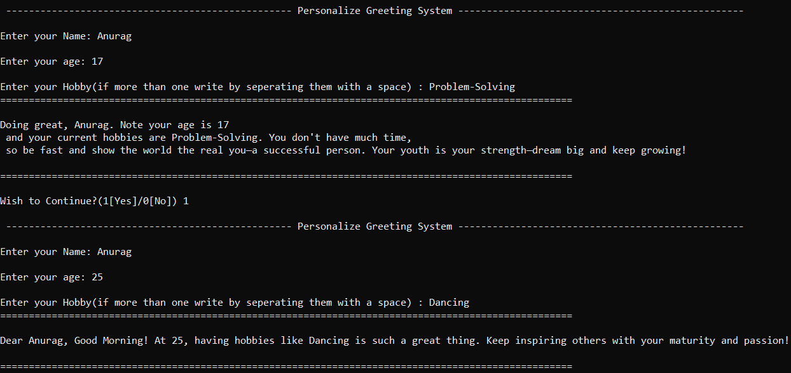

# 🎯 Project 02 – Number Guess Game

---

## 🌟 Overview
Number Guess Game is an interactive Python CLI application that challenges players to guess a randomly generated number between 1 and 20. With a polished terminal interface, robust input validation, and engaging feedback, it’s a perfect showcase of Python programming and user-centric design. Ideal for beginners learning Python or developers exploring CLI apps, this project is fun, educational, and highly extensible.

---

## ✨ Key Features

- **Personalized Gameplay:** Welcomes players by name with dynamic, friendly prompts.
- **Robust Validation:** Gracefully handles invalid inputs (e.g., non-numeric or out-of-range guesses).
- **Engaging Feedback:** Randomized, motivational messages celebrate correct guesses.
- **Polished Terminal UI:** Clean formatting with separators for a professional experience.

---

## 🧑‍💻 Skills Demonstrated

- **Python Mastery:** Functions, loops, error handling, and random number generation.
- **User-Centric Design:** Intuitive prompts and clear feedback for a delightful experience.
- **Code Quality:** Modular, well-documented, and maintainable codebase.
- **Open-Source Practices:** Professional README, licensing, and contribution guidelines.
- **Terminal UI:** Formatted output for readability and polish.

---

## 📸 Demo



---

## 🛠️ How It Works

The game’s logic is simple yet robust:

- **Initialization:** Generates a random number between 1 and 20 using Python’s random module.
- **User Input:** Collects the player’s name and guesses via input().
- **Validation:** Uses a try-except block to ensure guesses are valid integers within 1–20.
- **Feedback Loop:** Compares the guess to the target number, providing hints (e.g., "too high" or "too low") or a celebratory message for correct guesses.
- **Replay Option:** Asks if the player wants to continue, resetting with a new number if desired.

**Key functions:**
- `get_valid_guess()`: Ensures guesses are numeric and in range.
- `random_message()`: Selects a random congratulatory message.
- `main()`: Orchestrates the game loop and user interaction.

---

## 🚀 Quick Start

**Prerequisites:**  
Python 3.10+ installed

**Clone the repository:**
```bash
git clone https://github.com/anurag-ds/learning-python-2025.git
```

**Navigate to the project directory:**
```bash
cd learning-python-2025/project02_number_guess
```

**Run the script:**
```bash
python number_guess.py
```

**Play the game:**  
Enter your name, guess the number, and follow the prompts to win!

---

## 🏗️ Project Structure
```
project02_number_guess/
├── number_guess.py   # Main game logic
├── README.md         # This documentation
└── output.png        # Demo screenshot
```

---

## 💡 Future Enhancements

- **GUI Version:** Add a graphical interface using Tkinter or PyQt.
- **Score Tracking:** Implement a leaderboard to save high scores.
- **Difficulty Levels:** Allow players to choose number ranges (e.g., 1–50 or 1–100).
- **Multi-Language Support:** Translate prompts for global accessibility.
- **Game History:** Save player stats to a file or database.

---

## 🤝 Contributing

We love contributions! Here’s how to get started:

1. Fork the repository on GitHub.
2. Clone your fork:
   ```bash
   git clone https://github.com/<your-username>/learning-python-2025.git
   ```
3. Create a feature branch:
   ```bash
   git checkout -b feature/your-new-feature
   ```
4. Write clean code: Follow PEP 8 style guidelines and add comments for clarity.
5. Test your changes: Ensure the game runs without errors.
6. Commit your changes:
   ```bash
   git commit -m "Add your-new-feature"
   ```
7. Push to your fork:
   ```bash
   git push origin feature/your-new-feature
   ```
8. Open a Pull Request: Describe your changes and their impact.

**What to Contribute?**
- Bug fixes or performance optimizations.
- New features (e.g., scoring, difficulty levels).
- Enhanced UI/UX (e.g., colored terminal output).
- Documentation or translation updates.

For detailed guidelines, see CONTRIBUTING.md (coming soon, for now, follow PEP 8 and keep it simple!).

---

## 👤 Author

**Anurag Gupta**  
📧 askquestiontoanurag@gmail.com  
🌐 [GitHub Profile](https://github.com/anurag-ds)  

---

## 📄 License

This project is licensed under the MIT License. See the LICENSE file for details.

---

⭐ **Star this project on GitHub to show your support!**  
_Built with ❤️ by Anurag Gupta for Python enthusiasts everywhere._
